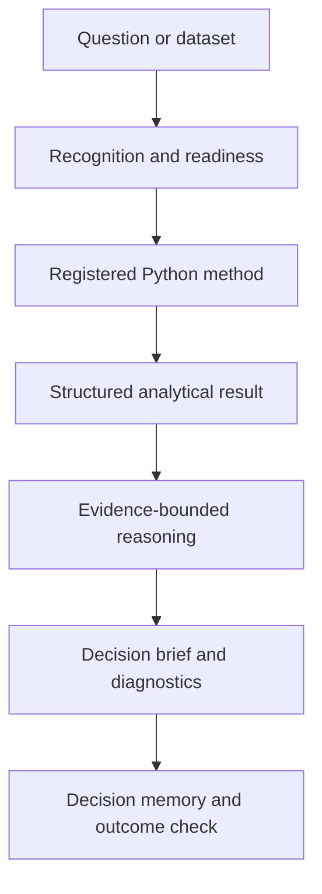

# CampaignLab

**Where marketing ideas face reality.**

CampaignLab is a portfolio-stage marketing decision system built by [Hassan Abrar](https://www.linkedin.com/in/hassanabrarsintown/). It combines deterministic Python analysis with bounded AI reasoning so marketers can move from a messy question or dataset to a decision they can inspect and defend.

> **Release status:** public portfolio pilot. The analytical workflows are tested; the bundled persistence layer is single-instance and is not represented as production multi-tenant SaaS.

## What it does

| Workspace | The job | What comes back |
|---|---|---|
| **Strategy Lab** | Stress-test a marketing or product decision | The move, why it wins, assumptions, risks, counterargument and the evidence that would change it |
| **Evidence Lab** | Understand a CSV/XLSX and run an eligible method | A decision brief, visual diagnostics, plain-language interpretation and optional statistical detail |
| **Marketing Mix Model** | Examine channel contribution and budget alternatives | Readiness checks, model diagnostics, response curves, constrained scenarios and a guarded allocation verdict |

> **Python calculates. CampaignLab challenges the evidence. You get the decision.**

## Try the product without private data

CampaignLab includes deterministic synthetic scenarios and a truth manifest documenting the signals used to generate them.

1. Use **Strategy Lab** to challenge one live marketing decision.
2. In **Evidence Lab**, load the campaign experiment or market-rollout demo.
3. In **Marketing Mix Model**, load the known-answer weekly media demo or watch the Data Builder align separate exports.
4. Inspect `examples/demo_truth_manifest.json` to compare the generated evidence with the known signal.

## Why it is not a generic AI wrapper

- Registered Python executors own statistical results.
- The AI can invoke only whitelisted analytical tools; it cannot execute arbitrary Python or SQL.
- Uploaded rows remain inside the running app process. The reasoning layer receives compact structured summaries.
- A method is marked ready only when a deterministic executor exists.
- Recommendations preserve uncertainty, assumptions, competing evidence, flip conditions and provenance.
- Decision Memory can preserve the prediction and later compare it with the observed outcome.

## Analytical coverage

Evidence Lab covers binary, continuous and multi-arm experiments; CUPED; bootstrap inference; robust linear and logistic regression; predictive models; marketing-efficiency, funnel, cohort and retention analysis; Difference-in-Differences; panel event studies; interrupted time series; segmentation; and anomaly detection.

The guarded MMM Beta adds carryover, diminishing returns, controls, regularization, chronological holdout validation, historical-window stability, leave-one-control-out sensitivity, optional experiment calibration, channel contribution, response curves and constrained budget scenarios. Observational attribution is never presented as automatically causal.

## Architecture



See [Architecture](docs/ARCHITECTURE.md) and [Security](SECURITY.md) for component and deployment boundaries.

## Run locally

Python 3.11 or 3.12 is recommended.

```powershell
python -m venv .venv
.\.venv\Scripts\python.exe -m pip install -r requirements.txt
.\.venv\Scripts\python.exe -m streamlit run app.py
```

Copy `.streamlit/secrets.toml.example` to `.streamlit/secrets.toml` and insert a valid key for AI-assisted workflows:

```toml
OPENAI_API_KEY = "your-key-here"
```

Never commit the real secrets file.

## Verify the build

```powershell
.\.venv\Scripts\python.exe -m pip install -r requirements-dev.txt
.\.venv\Scripts\python.exe -m compileall -q .
.\.venv\Scripts\python.exe -m pytest -q
```

## Deploy and present it

- [Deployment guide](docs/DEPLOYMENT.md)
- [Architecture](docs/ARCHITECTURE.md)
- [90-second demo script](docs/DEMO_SCRIPT.md)
- [LinkedIn launch draft](docs/LINKEDIN_LAUNCH.md)
- [Release audit protocol](docs/RELEASE_AUDIT_PROTOCOL.md)

## Repository map

```text
analytics/       deterministic analytical engines
core/            orchestration, uploads, memory and safety boundaries
engines/         structured reasoning and evidence arbitration
schemas/         output contracts
ui/              Streamlit product surfaces
visualization/   interactive and export-ready views
examples/        reproducible synthetic datasets and truth manifest
tests/           unit, contract, integration and UI checks
docs/            architecture, deployment and release documentation
```

## Known limits

- This is a public portfolio pilot, not a substitute for independent statistical, privacy or security review.
- SQLite Decision Memory is suitable for local or single-instance use, not multi-tenant customer data.
- MMM remains sensitive to history length, correlated channels, omitted demand drivers and data quality.
- A statistically valid result can still be commercially irrelevant. Business thresholds and human judgment remain part of the decision.
- Public demonstrations should use the bundled synthetic scenarios or non-sensitive data only.

Source: [github.com/honorablehassan/campaignlab-ai](https://github.com/honorablehassan/campaignlab-ai)
